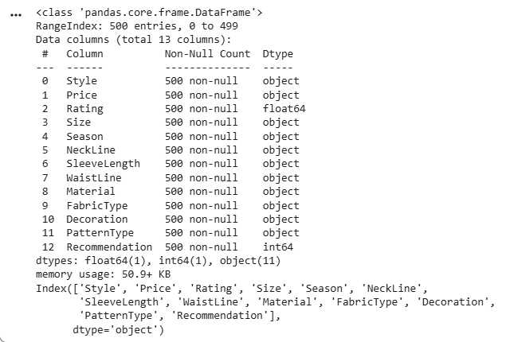
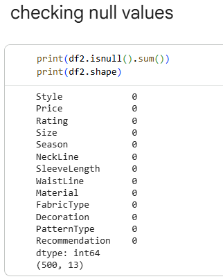
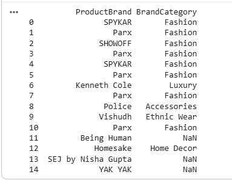
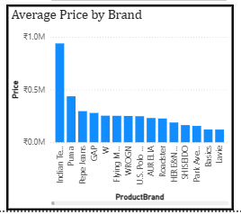

# 👗 Apparel & Textiles Data Analytics Project

## 📌 Project Overview

This project presents a six-week end-to-end data analytics project for a fictional apparel and fashion retail company, **StyleWear Pvt. Ltd.**

The project focuses on transforming apparel product data into meaningful business insights using Python, exploratory data analysis, data transformation, Power BI dashboards, trend analysis, and strategic recommendations.

---

## 🎯 Project Objectives

- Collect and prepare apparel-related datasets
- Clean and validate data using Python
- Perform Exploratory Data Analysis (EDA)
- Analyze products, brands, gender, pricing, and colors
- Perform data integration and category mapping
- Develop an interactive Power BI dashboard
- Analyze pricing and brand trends
- Evaluate forecasting approaches for future demand planning
- Generate business recommendations
- Document the complete analytics workflow

---

# 🔄 Project Analytics Journey

The project follows this end-to-end workflow:

**Data Collection & Cleaning → EDA → Data Mapping → Power BI Dashboard → Trend Analysis → Business Recommendations**

---

## 1️⃣ Cleaned Data — Week 1

The first stage focused on collecting apparel datasets and preparing them for analysis.

### Work Performed

- Loaded raw apparel datasets
- Checked dataset structure
- Identified missing values
- Checked duplicate records
- Standardized column names and values
- Validated data types
- Prepared cleaned datasets for further analysis

### 📊 Project Evidence



### 📁 Detailed Work

[View Week 1 — Data Collection & Cleaning](Week_1_Data_Collection_Cleaning/README.md)

---

## 2️⃣ Exploratory Data Analysis — Week 2

The second stage focused on understanding the characteristics and patterns within the apparel datasets.

### Analysis Performed

- Product distribution
- Brand distribution
- Gender distribution
- Price analysis
- Color analysis
- Descriptive statistics
- Data visualization

### 📊 Project Evidence



### 📁 Detailed Work

[View Week 2 — Exploratory Data Analysis](Week_2_EDA/README.md)

---

## 3️⃣ Data Integration & Mapping — Week 3

The third stage focused on transforming and organizing the available datasets.

Because the available datasets did not contain a reliable common unique identifier, a direct relational merge was not treated as appropriate.

Instead, categorical brand/category mapping and transformation were used to support the analysis.

### Example Mapping

| Product Brand | Category |
|---|---|
| SPYKAR | Fashion |
| Parx | Fashion |
| SHOWOFF | Fashion |
| Kenneth Cole | Luxury |
| Police | Accessories |
| Vishudh | Ethnic Wear |
| Homesake | Home Decor |

### 📊 Project Evidence



### 📁 Detailed Work

[View Week 3 — Data Integration](Week_3_Data_Integration/README.md)

---

## 4️⃣ Power BI Dashboard — Week 4

The fourth stage focused on developing an interactive business intelligence dashboard using Power BI.

### 📌 Key Performance Indicators

- Total Products
- Total Brands
- Average Product Price
- Highest Product Price
- Lowest Product Price
- Total Colors

### 📊 Dashboard Visualizations

- Product Count by Brand
- Product Distribution by Gender
- Average Price by Brand

### 🎛️ Dashboard Filters

- Product Brand
- Gender
- Primary Color

### 📊 Project Evidence


### 📁 Detailed Work

[View Week 4 — Power BI Dashboard](Week_4_PowerBI_Dashboard/README.md)

---

## 5️⃣ Trend Analysis & Forecasting — Week 5

The fifth stage focused on identifying pricing and brand-related trends and evaluating forecasting approaches.

### Analysis Performed

- Price trend analysis
- Brand trend analysis
- Pricing distribution
- Trend visualization
- Forecasting methodology evaluation

### Forecasting Approaches Evaluated

- Moving Average
- Linear Regression
- Time-Series Forecasting
- ARIMA / Exponential Smoothing for suitable historical time-based data

### ⚠️ Forecasting Limitation

The available dataset does not contain historical monthly or yearly sales data.

Therefore, an actual numerical sales forecast could not be fully trained and validated.

In a real-world implementation, historical data containing variables such as **Date, Product ID, Units Sold, Revenue, Discount, Customer Segment, and Season** would be required.

### 📊 Project Evidence



### 📁 Detailed Work

[View Week 5 — Trend Analysis & Forecasting](Week_5_Trend_Forecasting/README.md)

---

# 📈 Key Business Areas Analyzed

The project analyzed several important areas of apparel retail:

### 🏷️ Brand Portfolio

Analysis of the number and distribution of products across different brands.

### 💰 Pricing

Analysis of average, minimum, maximum, and distribution of product prices.

### 👥 Gender Segmentation

Analysis of product availability across different gender segments.

### 🎨 Product Colors

Analysis of commonly represented product colors.

### 📦 Inventory Planning

Identification of how analytics and forecasting could support future inventory decisions.

### 📊 Business Intelligence

Development of an interactive Power BI dashboard for business monitoring.

---

# 💡 Strategic Recommendations

Based on the analytical workflow, the following areas can support business decision-making:

1. Use historical sales data for improved inventory planning.
2. Monitor product pricing and brand-level pricing patterns.
3. Identify and monitor high-performing brands using sales and revenue data.
4. Develop customer-specific marketing strategies.
5. Consider sustainable and changing fashion preferences.
6. Build a validated demand forecasting system using historical sales data.

---

# ⚠️ Project Limitations

- Public datasets may not represent the complete apparel market.
- Historical sales data was not available.
- Actual demand forecasting could not be fully validated.
- Some category mappings involve business assumptions.
- External factors such as inflation, competitors, and market changes were not included.
- The available datasets provide limited customer-level information.

---

# 🛠️ Tools & Technologies

- Python
- Pandas
- NumPy
- Matplotlib
- Power BI
- Google Colab
- Jupyter Notebook
- Excel / CSV
- Git
- GitHub

---

# 📂 Project Structure

```text
apparel-textiles-data-analytics-internship/
│
├── README.md
│
├── Week_1_Data_Collection_Cleaning/
│
├── Week_2_EDA/
│
├── Week_3_Data_Integration/
│
├── Week_4_PowerBI_Dashboard/
│
├── Week_5_Trend_Forecasting/
│
└── Week_6_Final_Report/
