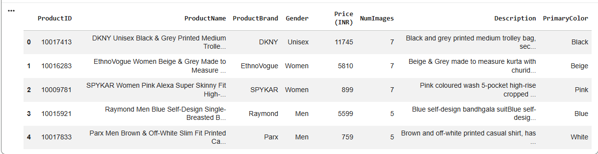
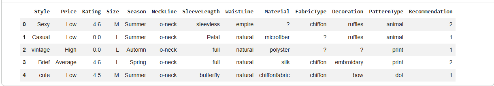

# Week 1 — Data Collection & Cleaning

## Overview

Week 1 focused on collecting and preparing apparel and fashion datasets for analysis. The datasets were inspected, cleaned, and standardized using Python and Pandas.

## Objectives

- Collect relevant apparel datasets
- Inspect dataset structure and data types
- Identify missing values
- Check duplicate records
- Review inconsistent values
- Prepare cleaned data for further analysis

## Datasets

### Dataset 1 — Fashion Products Dataset

Contains:

- ProductID
- ProductName
- ProductBrand
- Gender
- Price (INR)
- NumImages
- Description
- PrimaryColor
  

### Dataset 2 — Fashion Attributes Dataset

Contains attributes such as:

- Style
- Price
- Rating
- Size
- Season
- Material
- FabricType
- PatternType
- Recommendation

## Data Cleaning

The datasets were loaded using Pandas and checked for:

- Rows and columns
- Data types
- Missing values
- Duplicate records
- Categorical values

Example:

```python
df.isnull().sum()
df.duplicated().sum()
df.dtypes


