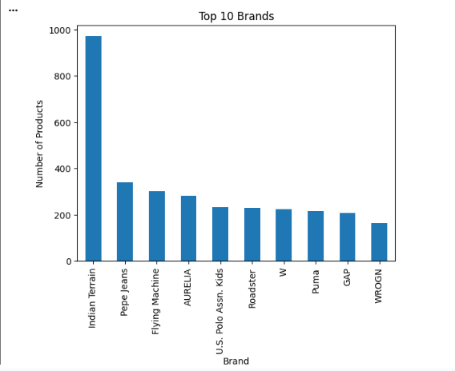

# Week 2 — Exploratory Data Analysis (EDA)

## Overview

Week 2 focused on performing Exploratory Data Analysis (EDA) on the cleaned apparel and fashion dataset prepared during Week 1.

The purpose of EDA was to understand the structure of the product catalog, identify important patterns, and generate business insights related to brands, gender, pricing, and product colors.

## Objectives

- Analyze the apparel product catalog
- Identify brands with larger product portfolios
- Analyze product distribution by gender
- Examine product pricing
- Identify commonly represented colors
- Create charts and visualizations
- Convert analytical findings into business insights

## Analysis Performed

### 1. Product Analysis

The number and distribution of products were analyzed to understand the overall size of the apparel catalog.

### 2. Brand Analysis

Products were grouped by `ProductBrand` to identify brands with larger product portfolios.

### 3. Gender Analysis

Products were analyzed across available gender categories to understand the distribution of the catalog.

### 4. Price Analysis

Product prices were analyzed using:

- Minimum price
- Maximum price
- Average price
- Price distribution

### 5. Color Analysis

The `PrimaryColor` field was analyzed to identify commonly represented colors in the product catalog.

## Visualizations

Charts created during the EDA are stored in the `charts/` folder.

Examples include:

- Brand-wise Product Distribution
- Product Distribution by Gender
- Product Price Distribution
- Product Color Distribution
  ## EDA Visualizations

### Brand-wise Product Distribution

**Figure 1: Brand-wise Product Distribution**

### Product Distribution by Gender

**Figure 2: Product Distribution by Gender**

### Product Price Distribution

**Figure 3: Product Price Distribution**

## Key Insights

The EDA provided insights into:

- Brand-level product presence
- Gender-based product distribution
- Product price ranges
- Frequently represented product colors

These insights were later used for dashboard development and business interpretation.

## Tools Used

- Python
- Pandas
- Matplotlib
- Google Colab / Jupyter Notebook

## Files

- `notebooks/` — EDA Python notebook
- `charts/` — EDA visualizations
- `Apparel_Textiles_EDA_Report.pdf` — Detailed Week 2 report

## Week 2 Report

[📄 View Week 2 EDA Report (PDF)](Apparel_Textiles_EDA_Report.pdf)

## Next Step

The findings from Week 2 were used in the next stages of the project, including data integration, transformation, dashboard development, trend analysis, and business recommendations.
