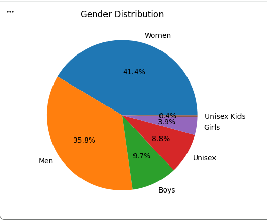
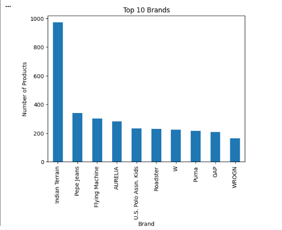
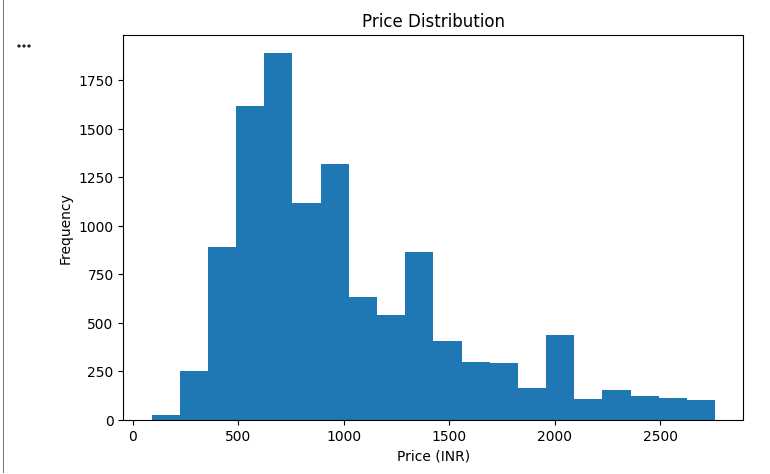

# Week 5 — Trend Analysis Charts

## Overview

This folder contains visualizations created during the Week 5 trend analysis and forecasting exercise.

## Charts

The visualizations may include:

- Product Price Trend
- Brand/Product Portfolio Trend
- Pricing Distribution
- Trend Analysis Visualization
- Forecasting Concept Visualization

## Purpose

These charts help communicate patterns identified in the apparel dataset and support the business interpretation presented in the Week 5 report.

## Tools

- Python
- Pandas
- Matplotlib
- Google Colab / Jupyter Notebook

## 📊 Trend Analysis Visualizations

### Gender Distribution

### Brand Trend

### Pricing Distribution

